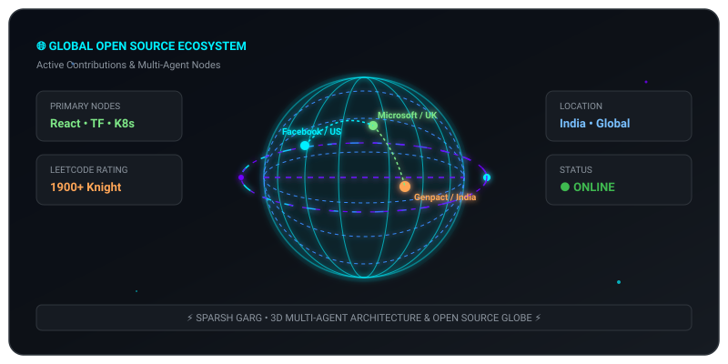

# <h1 align="center">⚡ SPARSH GARG ⚡</h1>
<h3 align="center">Software Developer & Multi-Agent AI Architect</h3>

  

  
  &nbsp;
  
  &nbsp;
  

---

<table style="border: 1px solid #30363d; border-radius: 12px; background: #0d1117; width: 100%;">
<tr>
<td style="padding: 16px;">

  🔴 &nbsp; 🟡 &nbsp; 🟢 &nbsp;&nbsp;&nbsp; <b>💬 SPARSH CYBER MESSENGER &amp; 3D ECOSYSTEM v2.5</b> &nbsp;&nbsp;&nbsp; <code>● ONLINE</code>

<b>👇 Click any message bubble below to chat and reveal responses in real-time:</b>

  
<b>💼 [CLICK TO CHAT]: What is Sparsh's current role at Genpact?</b>

   
  <blockquote style="background: #161b22; border-left: 4px solid #00f0ff; color: #e6edf3; padding: 10px;">
    <b>🤖 Sparsh AI Assistant:</b> 
    Sparsh is a <b>Software Developer at Genpact</b> engineering enterprise workflow automations. 
    He builds high-throughput ServiceNow &amp; Esker workflow automations integrated with Large Language Models (LLMs) and multi-agent AI architectures.
  </blockquote>

  
<b>🏆 [CLICK TO CHAT]: Show Sparsh's Open Source PRs (React, TensorFlow, Microsoft)</b>

   
  <blockquote style="background: #161b22; border-left: 4px solid #7ee787; color: #e6edf3; padding: 10px;">
    <b>🤖 Sparsh AI Assistant:</b> 
    Sparsh actively contributes to top global tech repositories: 
    • <b>Facebook / React</b> (<code>facebook/react</code>): Fixed DevTools Store crash during child reorders on filtered Suspense boundaries (<a href="https://github.com/react/react/pull/37018">PR #37018</a>). 
    • <b>Google / TensorFlow</b> (<code>tensorflow/tensorflow</code>): Fixed XLA constant propagation &amp; scalar dtype coercion in graph execution (<a href="https://github.com/tensorflow/tensorflow/pull/125381">PR #125381</a> &amp; <a href="https://github.com/tensorflow/tensorflow/pull/125382">PR #125382</a>). 
    • <b>Microsoft / ASP.NET Core &amp; VS Code</b>: Runtime routing and editor enhancements. 
    • <b>Kubernetes</b>: Orchestration utilities &amp; developer tooling.
  </blockquote>

  
<b>🪐 [CLICK TO CHAT]: Tell me about NEXUS Autonomous Multi-Agent AI System</b>

   
  <blockquote style="background: #161b22; border-left: 4px solid #d2a8ff; color: #e6edf3; padding: 10px;">
    <b>🤖 Sparsh AI Assistant:</b> 
    <b>NEXUS</b> is an autonomous multi-agent AI research hub capable of fetching live web intelligence, performing citation-backed reasoning, and generating full technical reports using Python, FastAPI, LangChain, and WebSockets.
  </blockquote>

  
<b>⚔️ [CLICK TO CHAT]: What are Sparsh's competitive programming stats?</b>

   
  <blockquote style="background: #161b22; border-left: 4px solid #ffa657; color: #e6edf3; padding: 10px;">
    <b>🤖 Sparsh AI Assistant:</b> 
    • <b>LeetCode Knight</b> with a peak rating of <b>1900+</b>. 
    • <b>Smart India Hackathon 2022</b> National Runner-Up (competing against 20,000+ teams). 
    • <b>CodeChef 3-Star</b> (Global Ranks 75 &amp; 114).
  </blockquote>

</td>
</tr>
</table>

---

## ⚡ About Me

I am a **Software Engineer** specializing in enterprise automation, multi-agent AI architectures, and high-performance software systems.

- 💼 **Current Role**: Software Developer at **Genpact**, engineering ServiceNow & Esker workflow automations integrated with Large Language Models (LLMs).
- 🌐 **Open Source**: Active contributor to major open-source projects including **Facebook (React)**, **Microsoft (ASP.NET Core, VS Code)**, **Google (TensorFlow)**, and **Kubernetes**.
- 🏆 **Competitive Programming**: **LeetCode Knight** (Peak Rating: 1900+) & **Smart India Hackathon 2022** National Runner-Up.

---

## 🏆 Open Source Contributions & Merged PRs

| Organization / Repo | Contribution & Impact | Status |
| :--- | :--- | :---: |
| **⚛️ Facebook / React** `facebook/react` | Fixed DevTools Store crash during child reorders on filtered Suspense boundaries in `renderer.js`. |  |
| **🧠 Google / TensorFlow** `tensorflow/tensorflow` | Fixed XLA constant propagation & scalar dtype coercion in graph execution (`tf.stack`, `tf.math.multiply`, `tf.pow`). |  |
| **🔷 Microsoft / ASP.NET Core** `dotnet/aspnetcore` | Framework runtime & HTTP routing enhancements. |  |
| **💻 Microsoft / VS Code** `microsoft/vscode` | Core editor UI and functionality fixes. |  |
| **☸️ Kubernetes** `kubernetes/kubernetes` | Orchestration utilities & developer experience tooling. |  |
| **🚀 Career-Ops** `santifer/career-ops` | Path resolution modules, CLI automations, and tests in JS & Go. |  |

---

## 📘 Featured Systems & Projects

- 🪐 **[NEXUS](https://github.com/SparshGarg999/NEXUS)** &mdash; Autonomous multi-agent AI research hub with citation-backed intelligence reports (Python, FastAPI, LangChain, WebSockets).
- 📐 **[ExamArchitect](https://github.com/SparshGarg999/ExamArchitect)** &mdash; Academic analytics portal with PDF parsing & prediction engine (React, Gemini 2.5 Flash, PostgreSQL).
- 💼 **[TarunPortfolio](https://github.com/SparshGarg999/TarunPortfolio)** &mdash; Modern interactive portfolio web application with Lenis smooth scrolling.

---

## 🛠️ Tech Stack & Arsenal

  
  
  
  
  
   
  
  
  
  
  
  

---

## 🏅 Honors & Achievements

- 🥇 **Smart India Hackathon 2022**: Runner-Up (out of 20,000+ national competing teams).
- ⚔️ **LeetCode Knight**: Peak Rating **1900+**.
- ⭐ **CodeChef 3-Star**: Global Ranks **75** and **114** in rated star rounds.
- 🎯 **CodeKaze**: Top 10 Rank in College division.

---

  <i>Designed & Engineered by Sparsh Garg</i>

