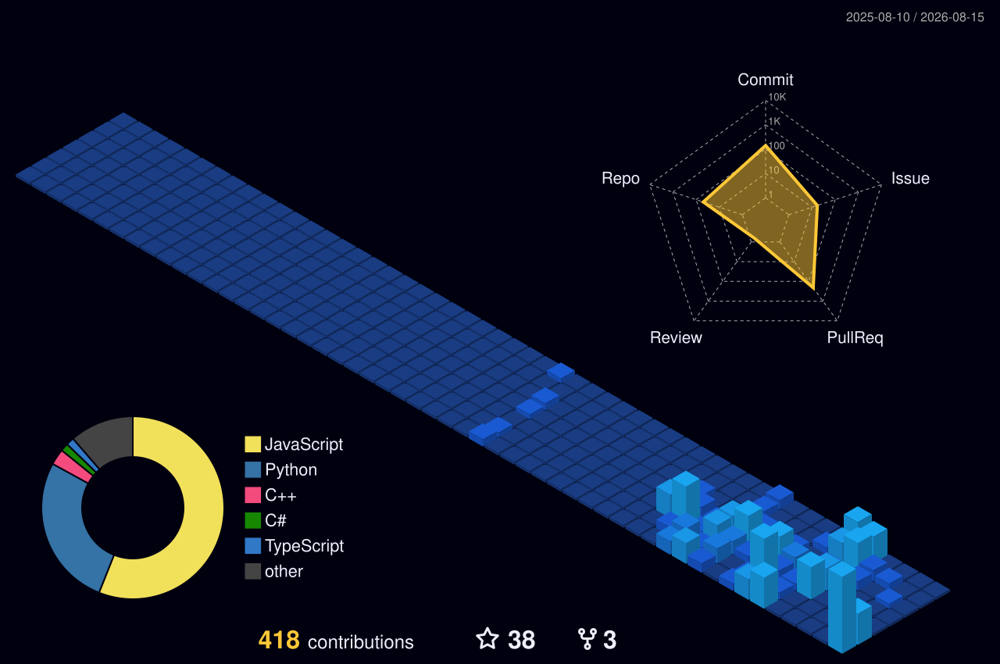

# Hi there, I'm Sparsh Garg 👋

  

  
  &nbsp;
  
  &nbsp;
  

---

## 🌐 3D Contribution Graph

  <picture>
    <source media="(prefers-color-scheme: dark)" srcset="profile-3d-contrib/profile-night-view.svg">
    <source media="(prefers-color-scheme: light)" srcset="profile-3d-contrib/profile-season-animate.svg">
    
  </picture>

---

## ⚡ About Me

I am a **Software Engineer** specializing in enterprise automation, multi-agent AI architectures, and high-performance software systems.

- 💼 **Current Role**: Software Developer at **Genpact**, engineering ServiceNow & Esker workflow automations integrated with Large Language Models (LLMs).
- 🌐 **Open Source**: Active contributor to major open-source projects including **Facebook (React)**, **Microsoft (ASP.NET Core, VS Code)**, **Google (TensorFlow)**, and **Kubernetes**.
- 🏆 **Competitive Programming**: **LeetCode Knight** (Peak Rating: 1900+) & **Smart India Hackathon 2022** National Runner-Up.

---

## 🏆 Open Source Contributions & Merged PRs

| Organization / Repo | Contribution & Impact | Status |
| :--- | :--- | :---: |
| **⚛️ Facebook / React** `facebook/react` | Fixed DevTools Store crash during child reorders on filtered Suspense boundaries in `renderer.js`. |  |
| **🔷 Microsoft / ASP.NET Core** `dotnet/aspnetcore` | Framework runtime & HTTP routing enhancements. |  |
| **💻 Microsoft / VS Code** `microsoft/vscode` | Core editor UI and functionality fixes. |  |
| **☸️ Kubernetes** `kubernetes/kubernetes` | Orchestration utilities & developer experience tooling. |  |
| **🧠 Google / TensorFlow** `tensorflow/tensorflow` | Machine learning execution workflow & API optimizations. |  |
| **🚀 Career-Ops** `santifer/career-ops` | Path resolution modules, CLI automations, and tests in JS & Go. |  |

---

## 📘 Featured Projects

- 🪐 **[NEXUS](https://github.com/SparshGarg999/NEXUS)** &mdash; Autonomous multi-agent AI research hub with citation-backed intelligence reports (Python, FastAPI, LangChain, WebSockets).
- 📐 **[ExamArchitect](https://github.com/SparshGarg999/ExamArchitect)** &mdash; Academic analytics portal with PDF parsing & prediction engine (React, Gemini 2.5 Flash, PostgreSQL).
- 💼 **[TarunPortfolio](https://github.com/SparshGarg999/TarunPortfolio)** &mdash; Modern interactive portfolio web application with Lenis smooth scrolling.

---

## 🛠️ Tech Stack & Skills

- **Languages**: Python, C++, Java, JavaScript, TypeScript, Go
- **Frameworks & Libraries**: React, Next.js, FastAPI, Node.js, Express.js, LangChain, TensorFlow
- **Enterprise & Cloud**: ServiceNow, Kubernetes, Docker, PostgreSQL, MongoDB, Git

---

## 🏅 Achievements

- 🥇 **Smart India Hackathon 2022**: Runner-Up (out of 20,000+ national competing teams).
- ⚔️ **LeetCode Knight**: Peak Rating **1900+**.
- ⭐ **CodeChef 3-Star**: Global Ranks **75** and **114** in rated star rounds.
- 🎯 **CodeKaze**: Top 10 Rank in College division.

---

## 📊 GitHub Stats & Activity

  
  &nbsp;
  

---

  <i>Designed & Developed by Sparsh Garg</i>

